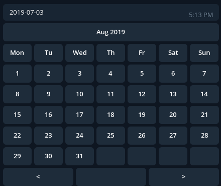

# Inline calendar for Telegram

My own implementation for inline calendar in telegram.  

### Prerequisites

Installing:
`
pip install https://github.com/Birdi7/Inline-calendar-for-telegram/archive/master.zip
`

### How it looks like?

### Examples 

[main.py](examples/main.py) - A complete python bot which demonstrates how to use the calendar

### Persistence of data

The calendar stores the data in-memory.
No persistence available.

## License

This project is licensed under the MIT License - see the [LICENSE](LICENSE) file for details

